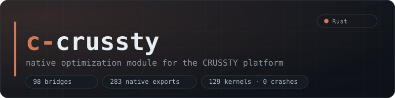
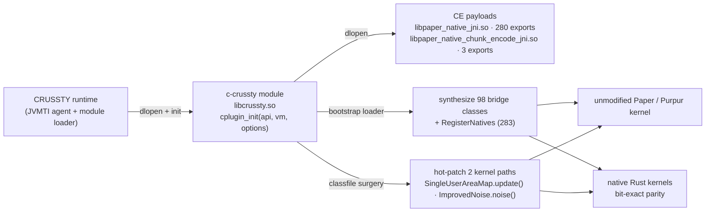

<div align="center">



[](https://github.com/PLANETA9091/c-crussty/actions/workflows/ci.yml)
[](.gitattributes)
[](https://github.com/PLANETA9091/CRUSSTY)
[](https://github.com/PLANETA9091/CRUSSTY)
[](.github/workflows/ci.yml)

**Injects the full Crussty CE native surface into any unmodified Paper/Purpur kernel — and nothing else.**
No gameplay changes · no content · no JVM flags · pure infrastructure.

[Architecture](docs/ARCHITECTURE.md) · [Benchmarks](docs/BENCHMARKS.md) · [Bridges](docs/BRIDGES.md) · [Kernel policy](docs/KERNEL_POLICY.md) · [Docs index](docs/INDEX.md)

</div>

---

## At a glance

- **What** — one module of the [CRUSSTY](https://github.com/PLANETA9091/CRUSSTY) platform (JVMTI agent + module runtime): **98 bridge classes** backed by **283 native JNI exports** from two shared libraries (`libpaper_native_jni.so`, `libpaper_native_chunk_encode_jni.so`), plus targeted **hot-patches** of two kernel hot paths, implemented in native Rust.
- **How** — the CRUSSTY runtime `dlopen`s this module (`cplugin_init`); it registers the native surface, self-proves it live, and arms the hot-patches. The kernel stays byte-identical upstream Paper/Purpur.
- **Proof** — every claim on this page is measured on a real server and gated by live self-tests. Regressions are published, never hidden.

## 📊 Measured: vanilla Paper vs Paper + c-crussty

Real-server paired A/B (Purpur 1.21.10, OpenJDK 21, fixed-seed world, 128 chunks of fresh worldgen per run, byte-identical world restore, exact Mann-Whitney).

| metric (median) | vanilla | + module (default) | Δ | + module (all levers) | Δ |
|---|---:|---:|---:|---:|---:|
| worldgen burst · CPU-s | 37.91 | 35.66 | ✅ **−5.9%** | 57.27 | ⚠️ **+51.1%** |
| worldgen burst · wall s | 41.0 | 38.0 | ✅ **−7.3%** | 55.5 | ⚠️ +35.4% |
| boot · s | 15.99 | 15.24 | ✅ −4.7% | 16.40 | ⚠️ +2.6% |
| RSS after burst · MB | 1122 | 1136 | ➖ +1.2% | 1421 | ⚠️ +26.6% |

- **Default posture** (what gets deployed) is cheaper than vanilla. The same lever family measured **significant** live on a bigger burst: PerlinNoise whole-body native bridge **−11.1% cpu / −12.3% wall**, exact MW p = 0.0079, parity 0/20000 bit-exact ([report](docs/results/PERLIN_AB_2026-09-09.md)).
- **All-levers posture** is *slower* on this burst (p = 0.006) — measured on purpose, and exactly why the kernel policy ships only proven wins. A FAIL is published, never hidden.
- Idle RSS with pure injection (stock JVM, `-agentpath` only, zero flags): **−29%** vs the flag-configured series ([report](docs/results/TASK129_PURE_INJECT_2026-09-09.md)).

<details>
<summary>Protocol, arms and raw data</summary>

Full protocol, arm validation and raw numbers: [`bench/ab/results/PAPER_AB_2026-10-03.md`](bench/ab/results/PAPER_AB_2026-10-03.md) — arms A (vanilla, n=7), B (module default, n=6), F (full surface, n=4); idle-gate detector, RCON channel, byte-identical world restore per run.

</details>

## ⚡ Native kernel-level wins (P500 sweep)

129 kernels / 49 groups / **0 crashes** ([report](docs/results/P500_REPORT.md)) — Paper-algorithm port vs optimized:

| speedup | kernel | old → optimized |
|---:|---|---|
| **318×** | NoiseChunkBlendCache empty-blender | 74.2 µs → 233 ns |
| **3.34×** | NoiseInterpolatorSlice jagged → flat | 6.2 ms → 1.9 ms |
| **1.24×** | NoiseChunkFlatCacheContext | 23.7 µs → 19.2 µs |
| **1.22×** | ImprovedNoiseInline gradient switch | 9.3 µs → 7.6 µs |

All numbers, gates and honesty rules: [`docs/BENCHMARKS.md`](docs/BENCHMARKS.md).

## 🔌 How it plugs into CRUSSTY

The CRUSSTY runtime scans `modules/` recursively and `dlopen`s every module; each module must export `cplugin_init(api, vm, options)`:



Deploy layout (`modules/crussty/`, payloads deliberately not a plugin dir):

```
modules/crussty/
├── libcrussty.so                            # this repo, cargo build --release
├── module.json                              # {"id":"crussty","version":"0.1.0"}
└── native/                                  # Crussty CE payloads
    ├── libpaper_native_jni.so               # 280 exports
    ├── libpaper_native_chunk_encode_jni.so  # 3 exports
    ├── JNI_EXPORTS.manifest                 # single source of truth for the bridge table
    └── MANIFEST.md · LICENSE                # provenance + SHA-256 + MIT
```

At init the module dlopens the payloads, synthesizes every bridge class the manifest implies, proves itself live (a real kernel writes through the bridge), then arms the hot-patches: `SingleUserAreaMap.update()` (default **on**) and `ImprovedNoise.noise(DDDDD)D` (env-gated, default off; perlin bridge default on since TASK-148).

<details>
<summary>Expected boot markers</summary>

```
[crussty-plugin] native surface live: 98 bridge classes, 283 natives registered (0 symbols unresolved)
[crussty-plugin] live proof: normalNoise.nativeCheck() = 1
[crussty-plugin] area_map: patched ... update() (5075 -> 3320 bytes)
[crussty-plugin] area_map: self-test OK (64 rects, native == naive set difference)
```

</details>

Run: start the kernel through the CRUSSTY runtime (`java -agentpath:libcrussty_runtime.so=modules=<dir>;... -jar purpur.jar nogui`) — **no other flags, ever** (owner law: injects only, [`docs/OWNER_DIRECTIVE_INJECTS_ONLY_2026-09-09.md`](docs/OWNER_DIRECTIVE_INJECTS_ONLY_2026-09-09.md)).

## 🗂 Layout

| path | what lives there |
|---|---|
| `src/` | Rust module — `lib.rs` pipeline, `jni_table.rs` (283-entry table), `classfile.rs` bytecode surgery, hot-patch + bridge lanes |
| `cplug-abi/` | module ABI (vendored platform contract) |
| `cplug-sdk/` | byte hooks, ASM weaving, kernel-class polling (vendored SDK) |
| `native/` | Crussty CE payloads (`.so` + manifest) + recovered full Rust sources of the CE kernels + `noise_ab` A/B instrument |
| [`bridges/`](docs/BRIDGES.md) | kernel-derived Java bridge sources + compiled payloads (embedded via `include_bytes!`) |
| `scripts/` | pinned per-bridge rebuild recipes (`scripts/build_*.sh`) |
| `bench/` | measurement — `ab/` (real-server A/B), `p500/` (kernel sweep), `world3/` (owner-rig world benchmark harness) |
| `tools/` | vendored build tools (ECJ compiler) |
| `tests/` | fixtures + kernel-coupled smoke/fuzz harnesses |
| [`docs/`](docs/INDEX.md) | ARCHITECTURE · BENCHMARKS · BRIDGES · KERNEL_POLICY · results/ |

> Kernel-derived Java material under `bridges/`, `tests/`, `bench/` and `scripts/` is excluded from the language stats by documented policy — see [`.gitattributes`](.gitattributes). Nothing is hidden; the module itself is pure Rust.

## 🛠 Build

```bash
cargo build --release        # → target/release/libcrussty.so (cdylib)
cargo test                   # 417 tests incl. byte-parity delivery gates
(cd native && cargo test)    # recovered CE kernels: 317 selftests
```

Runtime needs the two `native/*.so` payloads (committed; provenance and SHA-256 in [`native/MANIFEST.md`](native/MANIFEST.md)).

## 📈 Reproduce the benchmarks

```bash
bash bench/ab/run_paper_ab.sh seed     # one-time fixed-seed world
bash bench/ab/run_paper_ab.sh A 1      # vanilla leg  (B = module-default,
bash bench/ab/run_paper_ab.sh F 1      # full-surface) → bench/ab/results/
python3 bench/ab/aggregate_paper_ab.py
```

`bench/p500/` regenerates and runs the kernel sweep; `bench/world3/` holds the owner-rig MineShield-3 world-bench harness.

## 📜 Kernel policy & verification

- [`docs/KERNEL_POLICY.md`](docs/KERNEL_POLICY.md) — enforced selection policy: proven-win whitelist vs do-not-wire registry (documented regressions), env overrides.
- Everything the module claims is checked live: injection self-proof at boot, 64-rect set-difference self-test (area-map), handle round-trip self-test (noise), byte-parity delivery tests per bridge payload, kernel sweep as the `.so` regression gate.

## For agents

The development worklog lives in the private [`crussty-dev-logs`](https://github.com/PLANETA9091/crussty-dev-logs) repo (`c-crussty/` folder) — read it before working here, append after. Historical canon files (BENCHMARKS/PROGRESS/RESULTS_LEDGER/CRON_PROMPT_P501/…) are archived there under `archive-2026-10-03/`; pre-restructure tree: tag `pre-restructure-2026-10`; pre-cleanup branch map: `branch-manifest-2026-10-04.txt` in the same repo.

---

<div align="center">

<sub><b>c-crussty</b> is one module of <a href="https://github.com/PLANETA9091/CRUSSTY">CRUSSTY</a> — the JVMTI agent + module runtime for unmodified Paper-family kernels.</sub>

</div>
