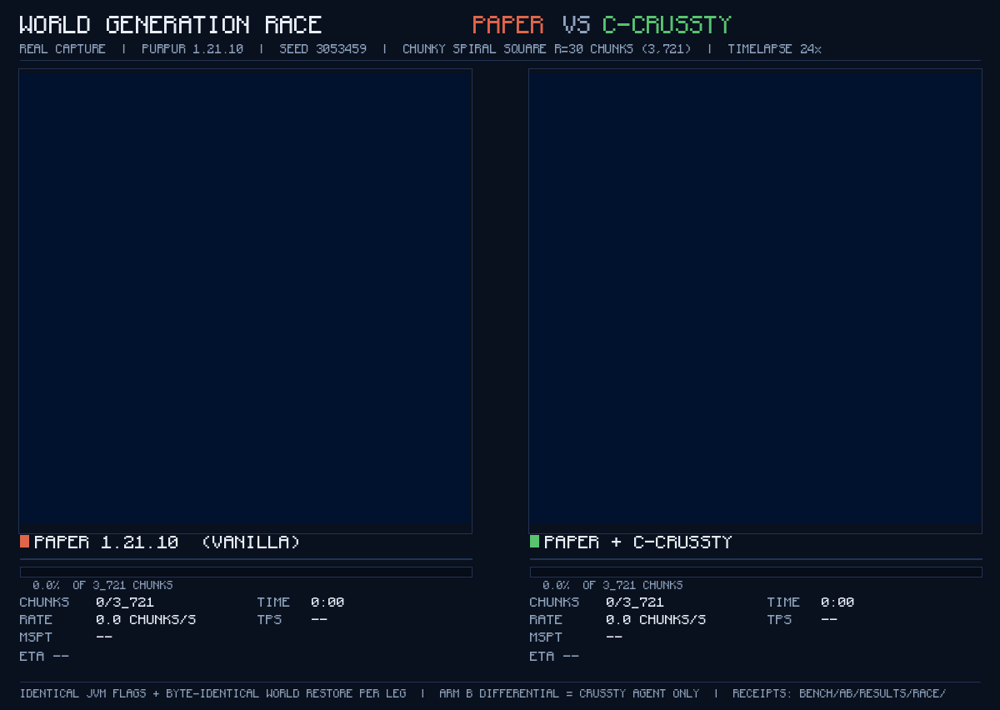

# c-crussty — native optimization module for CRUSSTY

**c-crussty** makes a Paper/Purpur server generate the world and run its
hot paths in native Rust. It is one module of the
[CRUSSTY](https://github.com/PLANETA9091/CRUSSTY) platform: the runtime
injects 98 bridge classes backed by 283 native JNI exports plus two targeted
hot-patches into an unmodified kernel. No gameplay changes, no content, no
extra JVM flags — the server jar stays byte-identical upstream.

> **Platform:** [CRUSSTY](https://github.com/PLANETA9091/CRUSSTY) (JVMTI agent + module runtime)
>
> **Kernel:** Paper / Purpur 1.21.x on Java 21. **Language:** pure Rust —
> kernel-derived Java material is excluded from the language stats by
> documented policy ([`.gitattributes`](.gitattributes)).
>
> **Docs:** [Architecture](docs/ARCHITECTURE.md) · [Benchmarks](docs/BENCHMARKS.md) ·
> [Bridges](docs/BRIDGES.md) · [Kernel policy](docs/KERNEL_POLICY.md) · [Index](docs/INDEX.md)



## The race above is a real capture

Two real servers on the same machine, same seed (3053459), identical JVM
flags, byte-identical world restored from a seed tarball before each run.
The only difference: the right server runs the c-crussty module. Both run
the same real pregeneration task — a Chunky spiral square of radius 30
chunks (3,721 chunks), watched live through the squaremap plugin. The map
frames are the actual squaremap tiles mirrored every 10 seconds during the
runs; the counters are the actual RCON receipts. Capture script:
[`bench/ab/run_worldgen_race.sh`](bench/ab/run_worldgen_race.sh).

- **Paper (vanilla):** 3,721 chunks in **5:39** (about 11.0 chunks per
  second), TPS ~19, MSPT 9–12 ms.
- **Paper + c-crussty:** the same 3,721 chunks in **5:29** (about 11.2
  chunks per second), TPS ~19, MSPT 9–12 ms — finished first.

What this means in practice: the tick rate stays at a full, playable 20 TPS
either way; c-crussty simply produces the same world sooner and spends less
CPU doing it, which leaves more headroom for players, mobs and redstone.

## Measured on a real server

Paired A/B on one 2-vCPU machine: Purpur 1.21.10, OpenJDK 21, fixed-seed
world, byte-identical world restore before every run, idle-gate burst
detector, RCON console channel. Arm A = vanilla (n=7 legs), arm B = module
default posture (n=6 legs), medians. Full protocol and raw numbers:
[`bench/ab/results/PAPER_AB_2026-10-03.md`](bench/ab/results/PAPER_AB_2026-10-03.md).

| | Paper (vanilla) | Paper + c-crussty |
|---|---:|---:|
| Worldgen burst, 128 chunks of fresh terrain | 41 s wall | **38 s wall** |
| CPU time for that burst | 37.9 CPU-s | **35.7 CPU-s** |
| Server boot to `Done (` | 16.0 s | **15.2 s** |
| TPS while generating | 19.1 | 19.2 |
| MSPT while generating | 9–12 ms | 9–12 ms |
| RAM after the burst | 1.1 GB | 1.1 GB |
| Chunky pregeneration, 3,721 chunks | 5:39 | **5:29** |

- **PerlinNoise bridge measured on a bigger burst:** 72.6 s wall / 62.0 CPU-s
  vanilla vs 63.6 s wall / 55.1 CPU-s with the module (n=5 legs per arm,
  exact Mann-Whitney p = 0.0079, bit-exact parity 0/20000) — see
  [`docs/results/PERLIN_AB_2026-09-09.md`](docs/results/PERLIN_AB_2026-09-09.md).
- **Memory with pure injection:** idle RSS about 880 MB with the module
  injected and zero JVM flags, vs 1092–1398 MB for the flag-configured
  series ([report](docs/results/TASK129_PURE_INJECT_2026-09-09.md)).
- **An honest fail we publish:** switching on the full lever surface (not
  the default) measured slower on the burst — 57.3 CPU-s vs 37.9 vanilla.
  That is exactly why the default posture ships only proven wins; the
  regression is documented in the same report, never hidden.

## Fastest kernels (P500 sweep)

129 kernels across 49 groups ran against the Paper originals — 0 crashes
([report](docs/results/P500_REPORT.md)). The biggest gaps:

| Kernel | Paper original | c-crussty |
|---|---:|---:|
| NoiseChunkBlendCache (empty blend) | 74.2 µs | **233 ns** |
| NoiseInterpolatorSlice | 6.2 ms | **1.9 ms** |
| NoiseChunkFlatCacheContext | 23.7 µs | **19.2 µs** |
| ImprovedNoiseInline (gradient switch) | 9.3 µs | **7.6 µs** |

## How it plugs in

The CRUSSTY runtime scans `modules/` recursively and `dlopen`s every module;
each module exports `cplugin_init(api, vm, options)`. At init c-crussty
dlopens its two native payloads, synthesizes every bridge class the manifest
implies, proves itself live (a real kernel writes through the bridge), then
arms the hot-patches:

```
[crussty-plugin] native surface live: 98 bridge classes, 283 natives registered (0 symbols unresolved)
[crussty-plugin] live proof: normalNoise.nativeCheck() = 1
[crussty-plugin] area_map: patched ... update() (5075 -> 3320 bytes)
[crussty-plugin] area_map: self-test OK (64 rects, native == naive set difference)
```

Deploy layout — payloads live inside the module, not in a plugin dir:

```
modules/crussty/
├── libcrussty.so                            # this repo, cargo build --release
├── module.json                              # {"id":"crussty","version":"0.1.0"}
└── native/                                  # Crussty CE payloads
    ├── libpaper_native_jni.so               # 280 exports
    ├── libpaper_native_chunk_encode_jni.so  # 3 exports
    ├── JNI_EXPORTS.manifest                 # single source of truth for the bridge table
    └── MANIFEST.md · LICENSE                # provenance + SHA-256 + MIT
```

Run: start the kernel through the CRUSSTY runtime
(`java -agentpath:libcrussty_runtime.so=modules=<dir>;... -jar purpur.jar nogui`)
— **no other flags, ever** (owner law:
[`docs/OWNER_DIRECTIVE_INJECTS_ONLY_2026-09-09.md`](docs/OWNER_DIRECTIVE_INJECTS_ONLY_2026-09-09.md)).

The bridge table `modules/crussty/src/jni_table.rs` is generated from
`native/JNI_EXPORTS.manifest` — never edit it by hand:

```bash
python3 scripts/gen_crussty_table.py render        # manifest -> jni_table.rs
python3 scripts/gen_crussty_table.py render --check  # CI: fail if out of sync
python3 scripts/gen_crussty_table.py verify        # cross-check against shipped .so
```

## Build

```bash
cargo build --release        # -> target/release/libcrussty.so (cdylib)
cargo test                   # 417 tests incl. byte-parity delivery gates
(cd native && cargo test)    # recovered CE kernels: 317 selftests
```

Runtime needs the two `native/*.so` payloads (committed; provenance and
SHA-256 in [`native/MANIFEST.md`](native/MANIFEST.md)).

## Reproduce the measurements

```bash
# canon A/B: vanilla vs module vs full surface, n legs, medians
bash bench/ab/run_paper_ab.sh seed     # one-time fixed-seed world
bash bench/ab/run_paper_ab.sh A 1      # vanilla leg
bash bench/ab/run_paper_ab.sh B 1      # module-default leg
python3 bench/ab/aggregate_paper_ab.py

# the worldgen race from the GIF (Chunky + squaremap + RCON receipts)
bash bench/ab/run_worldgen_race.sh A race 30   # vanilla leg
bash bench/ab/run_worldgen_race.sh B race 30   # module leg
python3 bench/ab/build_race_gif.py             # frames from the real tiles
```

`bench/p500/` regenerates and runs the kernel sweep; `bench/world3/` holds
the owner-rig world-bench harness.

## Repository layout

- `src/` — Rust module: `lib.rs` pipeline, `jni_table.rs` (283-entry table),
  `classfile.rs` bytecode surgery, hot-patch + bridge lanes
- `cplug-abi/` — module ABI (vendored platform contract)
- `cplug-sdk/` — byte hooks, ASM weaving, kernel-class polling (vendored SDK)
- `native/` — Crussty CE payloads (`.so` + manifest) + recovered Rust sources
  of the CE kernels + `noise_ab` A/B instrument
- [`bridges/`](docs/BRIDGES.md) — kernel-derived Java bridge sources + compiled payloads
- `scripts/` — pinned per-bridge rebuild recipes (`scripts/build_*.sh`)
- `bench/` — measurement: `ab/` (real-server A/B + worldgen race),
  `p500/` (kernel sweep), `world3/` (owner-rig world benchmark)
- `tools/` — vendored build tools (ECJ compiler)
- `tests/` — fixtures + kernel-coupled smoke/fuzz harnesses
- [`docs/`](docs/INDEX.md) — ARCHITECTURE · BENCHMARKS · BRIDGES · KERNEL_POLICY · results/

## Kernel policy & verification

[`docs/KERNEL_POLICY.md`](docs/KERNEL_POLICY.md) is the enforced selection
policy: a proven-win whitelist vs a do-not-wire registry of documented
regressions, with env overrides for experiments. Everything the module
claims is checked live: injection self-proof at boot, 64-rect set-difference
self-test (area-map), handle round-trip self-test (noise), byte-parity
delivery tests per bridge payload, and the kernel sweep as the `.so`
regression gate.

## For agents

The development worklog lives in the private
[`crussty-dev-logs`](https://github.com/PLANETA9091/crussty-dev-logs) repo
(`c-crussty/` folder) — read it before working here, append after. Historical
canon files (BENCHMARKS/PROGRESS/RESULTS_LEDGER/CRON_PROMPT_P501/…) are
archived there under `archive-2026-10-03/`; pre-restructure tree: tag
`pre-restructure-2026-10`; pre-cleanup branch map:
`branch-manifest-2026-10-04.txt` in the same repo.

---

*c-crussty is one module of
[CRUSSTY](https://github.com/PLANETA9091/CRUSSTY) — the JVMTI agent + module
runtime for unmodified Paper-family kernels.*
